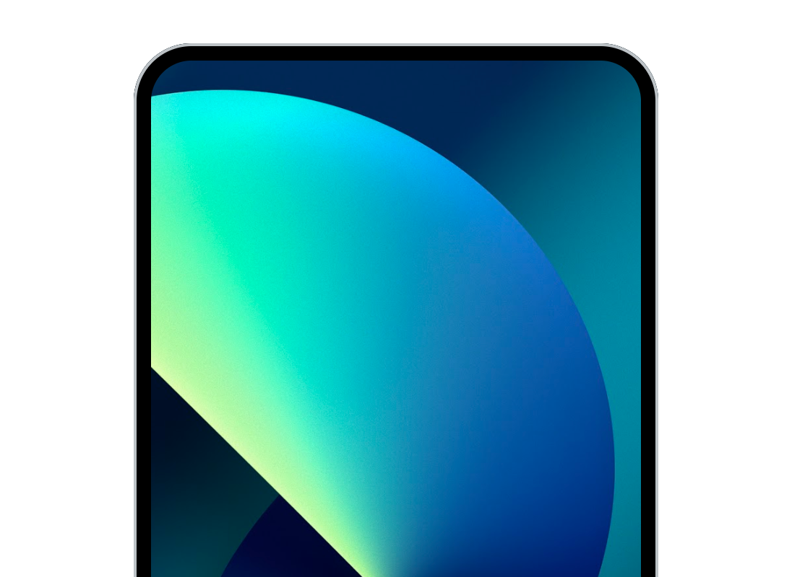
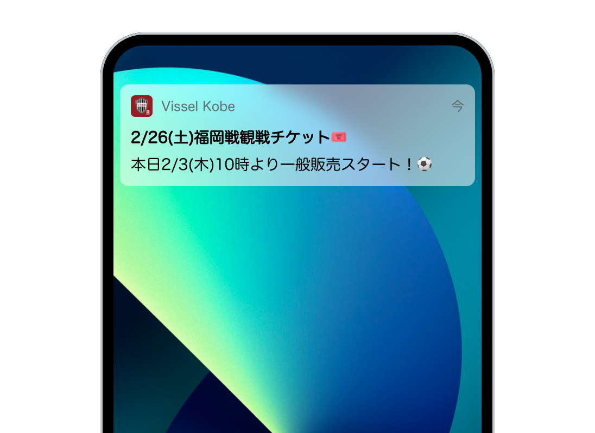
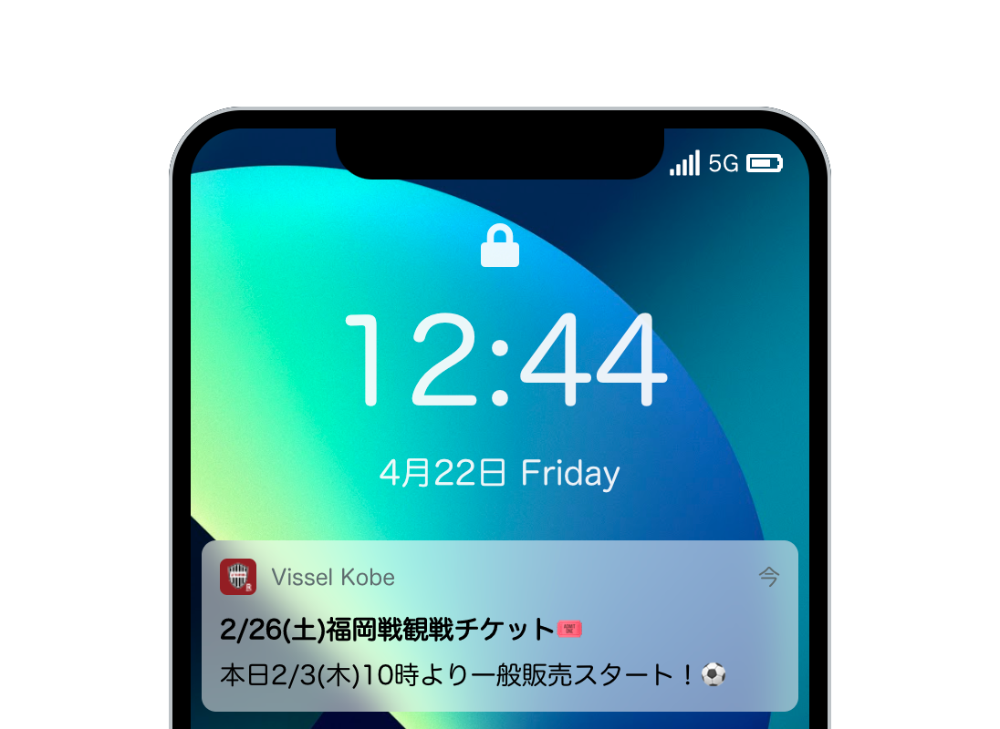

# Coding push notifications 📱

Create a preview UI for push notifications using HTML and stylesheets 😉  
You are free to implement it however you wish~  
Have fun!
## Preparation
Run the following command to install the module
```
cd /ios-notice

npm install
```
## Application Execution
```
npm start
```
Only the iPhone frame should be visible  

By the way, the `image` is **wallpaper only** ( Everything else is `HTML` + `CSS` )

## Already available frameworks
* [React.js](https://reactjs.org/)
* [MATERIAL-UI](https://v4.mui.com/) (v4.x)
    * [Material Icons](https://v4.mui.com/components/material-icons/)
* [Font Awesome](https://fontawesome.com/)

## Source code
Created with [React create app](https://create-react-app.dev/) + α
```
npx create-react-app 
```

```
📁 ios-notice
├ 📁 public
├ 📁 src
│ ├ 📁 component
│ │ └ AppPushPreview.jsx ← 📝 Edit this file
│ ├ 📁 img
│ ├ App.js
│ ├ index.js
 ...
```

## STEP 1
### Let's fetch json files for push data
Edit `src/App.js` and assign the contents of the `json` file to React variables.
You will also need to deal with the case where the value does not exist in the variable.
* `/public/json/notice.json`

## SETP 2
### Receive values in the preview component

Edit `src/component/AppPushPreview.jsx` to get values from `props`
* title
* body
* name

`app icon` is not included in the json file and cannot be retrieved  
Please use `visselIconSrc` since it has already been imported

## STEP 3
### Create `HTML` and `stylesheet` for notifications  
Please refer to the images below~  



If the [Grow](https://v4.mui.com/components/transitions/#grow) transition component is used well, it looks more like a push notification.

## STEP 4 ( If you have time to spare )
The notification UI alone is lonely, so please make it more iPhone-like 😆
* Time 
* Radio Status
* Battery level etc...

For time and day of the week, you can use [moment.js](https://momentjs.com/)  
Also, you can use [Material Icons](https://v4.mui.com/components/material-icons/) and [Font Awesome](https://fontawesome.com/) for the icons.




